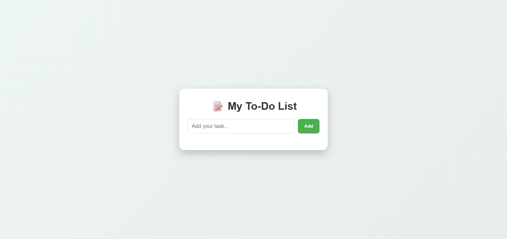

# 📝 To-Do List App

A simple and interactive **To-Do List Web Application** that helps users manage daily tasks efficiently.  
This project allows users to add, complete, and delete tasks while storing data locally in the browser for persistence.

---

## 🚀 Live Demo
👉 https://rafikshaik07.github.io/To-Do-list-/

---

## 📌 Features

- ✅ Add new tasks
- ✏️ Mark tasks as completed
- 🗑️ Delete tasks
- 💾 Saves tasks using Local Storage
- 📱 Responsive design
- ⚡ Simple and user-friendly interface

---

## 🛠️ Technologies Used

- **HTML5** — Application structure
- **CSS3** — Styling and layout
- **JavaScript (ES6)** — Application logic
- **Local Storage API** — Data persistence

---

## 📸 Preview

---

## 📂 Project Structure

todo-list/
│

├── index.html

├── style.css

├── script.js

└── preview.png
